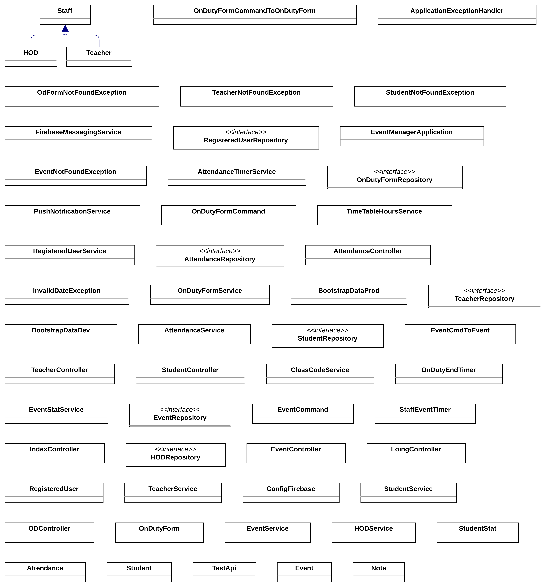

# Event-Manager
## About The Project

A user friendly mobile app that includes features to manage any kind of event or activity that is performed within an institution. It is a handy, all in one manager using which you can assign events to group of people and also keep track of who completed those events, who are all yet to complete and also monitor the past and present activities of the people. 

Here's why:
* User friendly way of updating the status of the activities.
* Time saving and easy way to monitor the mass of people under any institution.
* More Secure and keeps up your privacy :cowboy_hat_face:

## Built With

Our project is completely built in Java. We have utilised the core concepts of Spring to make our app more manageable.
* [Spring](https://spring.io/)
* [Flutter](https://flutter.dev/)

## UML Diagrams

* Entity Relationship Diagram

* Use Case Diagram

* Class Diagram

# Api documentaion (Postman)
[Attendance API's](https://documenter.getpostman.com/view/25479641/2s93JzMgJJ)
[Event API's](https://documenter.getpostman.com/view/25479641/2s93JzMgJL)
[Od API's](https://documenter.getpostman.com/view/25479641/2s93JzMgNb)
[Teacher API's](https://documenter.getpostman.com/view/25479641/2s93JzMgNd)
