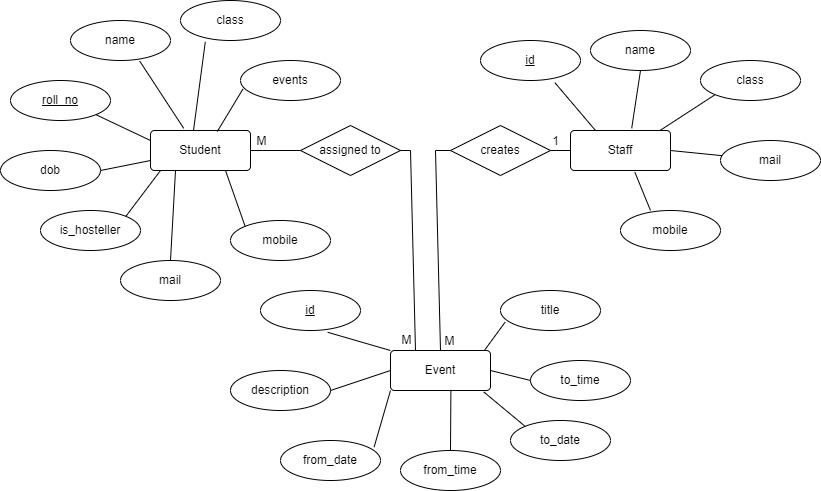
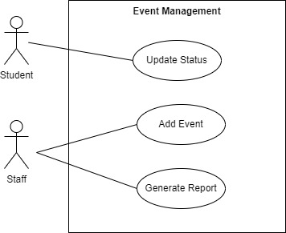

# Event-Manager
## About The Project

A user friendly mobile app that includes features to manage any kind of event or activity that is performed within an institution. It is a handy, all in one manager using which you can assign events to group of people and also keep track of who completed those events, who are all yet to complete and also monitor the past and present activities of the people. 

Here's why:
* User friendly way of updating the status of the activities.
* Time saving and easy way to monitor the mass of people under any institution.
* More Secure and keeps up your privacy :cowboy_hat_face:

## Built With

Our project is completely built in Java. We have utilised the core concepts of Spring to make our app more manageable.
* [Spring](https://spring.io/)
* [Flutter](https://flutter.dev/)

## UML Diagrams


* Entity Relationship Diagram



* Use Case Diagram



* Class Diagram


# Teacher Controller API Documentation

This is the API documentation for the Teacher Controller. It provides various endpoints for managing teacher events, student attendance, and on-duty forms.

## Base URL

The base URL for all endpoints mentioned in this document is `http://localhost:8080`.

## API Endpoints

### 1. Get Pending Events for a Teacher

Get all the pending events for a teacher by teacher ID.

**URL:** `/teacher/events/pending/{staffId}`

**Method:** `POST`

**Request Parameters:**

- `staffId`: The ID of the teacher whose events are to be retrieved. (Required)

**Example Curl Command:**

```curl
curl --location --request POST 'http://localhost:8080/teacher/events/pending/1234' \
--header 'Content-Type: application/json' \
--data-raw '{
    "staffId": "1234"
}'
```


# TeacherController API Documentation

This document provides an overview of the TeacherController API, which exposes endpoints for performing operations on events, attendance, and on-duty forms for teachers. 

## API Overview

The TeacherController API provides the following endpoints:

| Endpoint | Method | Description |
| -------- | ------ | ----------- |
| `/teacher/events/pending/{staffId}` | POST | Get pending events for a given staff ID |
| `/teacher/getClassCode/{staffId}` | POST | Get the class code for a given staff ID |
| `/teacher/events/past-five/{staffId}` | POST | Get the past five events for a given staff ID |
| `/teacher/event/stats/{eventId}/{staffId}` | POST | Get the status of an event for a given event ID and staff ID |
| `/teacher/event/stats-list/{eventId}/{staffId}` | POST | Get the status of all students for a given event ID and staff ID |
| `/teacher/event/new` | POST | Create a new event |
| `/teacher/student/getList/{staffId}` | POST | Get a list of students for a given staff ID |
| `/teacher/student/attendanceList/{staffId}/{date}` | POST | Get attendance status for all students for a given staff ID and date |
| `/teacher/getAttendancePercentage/daily/{staffId}/{startDate}/{endDate}` | POST | Get the daily attendance percentage for a given staff ID and date range |